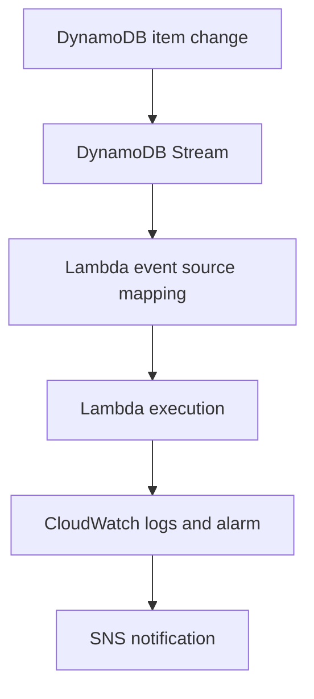

# Lab 06 — Serverless Events and Observability

## Overview

This project connects a DynamoDB change stream to AWS Lambda, verifies execution through CloudWatch, and uses a CloudWatch alarm with Amazon SNS to complete an observable event-and-notification path.

## Configuration

| Component | Configuration |
| --- | --- |
| Region | US East (Ohio), `us-east-2` |
| Lambda | HTTP blueprint; Node.js 22.x; x86_64 |
| Function URL authorization | `NONE` for the temporary lab endpoint |
| DynamoDB table | String partition key; on-demand capacity |
| DynamoDB stream | New and old images enabled |
| Event source mapping | Active; batch size 100; starting position Latest |
| Stream permission | `AWSLambdaDynamoDBExecutionRole` added to the execution role |
| CloudWatch alarm | Lambda Invocations greater than or equal to 1 for one datapoint in one minute |
| Notification action | Dedicated Amazon SNS topic with email delivery |

## Implementation

1. Created the Lambda function and confirmed direct invocation through its temporary Function URL.
2. Created the DynamoDB table and enabled its change stream.
3. Added stream-read permissions to the Lambda execution role.
4. Connected the stream to Lambda with an event source mapping.
5. Wrote two proof items to the table to generate events and alarm activity.
6. Configured a CloudWatch invocation alarm and attached the SNS notification action.

## Validation

| Check | Result |
| --- | --- |
| Event source mapping | Active |
| Lambda execution | CloudWatch recorded INIT, START, END, and REPORT entries |
| DynamoDB changes | Two proof items generated stream events |
| Alarm state | Invocation alarm entered `ALARM` |
| Alarm action | SNS email notification arrived |

## Security and privacy decisions

- The unauthenticated Function URL was temporary and deleted after the exercise.
- The live Function URL, email address, and SNS subscription links were excluded from the repository.
- Stream access was added to the Lambda execution role only for the functions required by the event source mapping.

## Cleanup

The CloudWatch alarm, SNS topic, DynamoDB event source mapping, table, backups, Lambda function, CloudWatch log group, execution role, and generated policy were deleted. Each service list was checked after cleanup.

## Key takeaways

- DynamoDB Streams capture item changes; an event source mapping polls the stream and delivers batches to Lambda.
- Lambda execution roles need separate permissions for stream reads and runtime logging.
- Logs, metrics, alarms, and notification actions provide different layers of observability.
- Serverless resources still require deliberate lifecycle cleanup.

[Back to project index](../../README.md)
