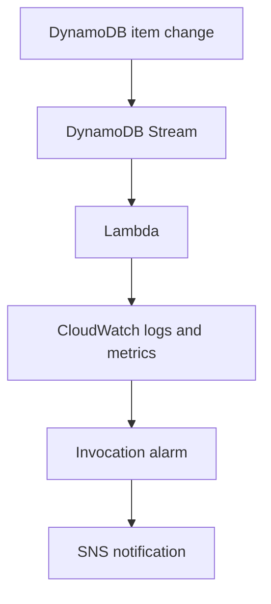

# Lab 06 — Serverless Events and Observability

**Author:** DevGarza
**Date:** September 10, 2026 (Pacific)
**Region:** US East (Ohio), `us-east-2`
**Status:** Completed; all temporary resources removed

## Goal

Connect DynamoDB Streams to Lambda, observe execution in CloudWatch, trigger an alarm action through SNS, and verify full cleanup.

## Configuration

| Component | Value |
| --- | --- |
| Lambda | `devgarza-lambda-http-lab`; HTTP blueprint; Node.js 22.x; x86_64 |
| Function URL auth | `NONE`, acknowledged for the temporary lab |
| Execution role | `devgarza-lambda-http-lab-role-ajik78f3` |
| DynamoDB | `devgarza-lambda-stream-lab`; `id` String key; on-demand |
| Stream / trigger | New + old images; active; batch 100; starting position Latest |
| Added policy | `AWSLambdaDynamoDBExecutionRole` |
| Log group | `/aws/lambda/devgarza-lambda-http-lab` |
| Alarm | `devgarza-lambda-invocation-proof-alarm`; Invocations ≥ 1 for one datapoint in one minute |
| SNS | `devgarza-lambda-alarm-topic` |

Lambda (evidence reviewed privately) · Stream (evidence reviewed privately) · Trigger (evidence reviewed privately)

The actual Function URL is excluded and deleted.

## Verification

I invoked the HTTP function; attached the stream permissions; enabled the trigger; and added `test-001` (`Lambda trigger proof`) and `test-002` (`CloudWatch alarm proof`). CloudWatch showed successful INIT, START, END, and REPORT events. The invocation alarm entered **ALARM**, and its SNS email action arrived.

Logs (evidence reviewed privately) · Alarm and proof items (evidence reviewed privately)

Email/subscription screenshots are excluded because they contain personal or unsubscribe information.

## Cleanup

| Resource | Proof |
| --- | --- |
| Alarm | Deleted (evidence reviewed privately) |
| SNS topic | Deleted (evidence reviewed privately) |
| DynamoDB trigger | Removed (evidence reviewed privately) |
| DynamoDB table / backups | Table empty (evidence reviewed privately) · Backups empty (evidence reviewed privately) |
| Lambda function | List empty (evidence reviewed privately) |
| CloudWatch log group | List empty (evidence reviewed privately) |
| Execution role / generated policy | Role deleted (evidence reviewed privately) · Policy deleted (evidence reviewed privately) |

## Lessons

- A stream records item changes; the event source mapping delivers batches to Lambda.
- Lambda's execution role needs permissions for runtime logging and the DynamoDB stream.
- CloudWatch supplied execution evidence and the alarm signal; SNS performed the action.
- Serverless resources still require deliberate lifecycle cleanup.

[Back to lab index](../../README.md)
