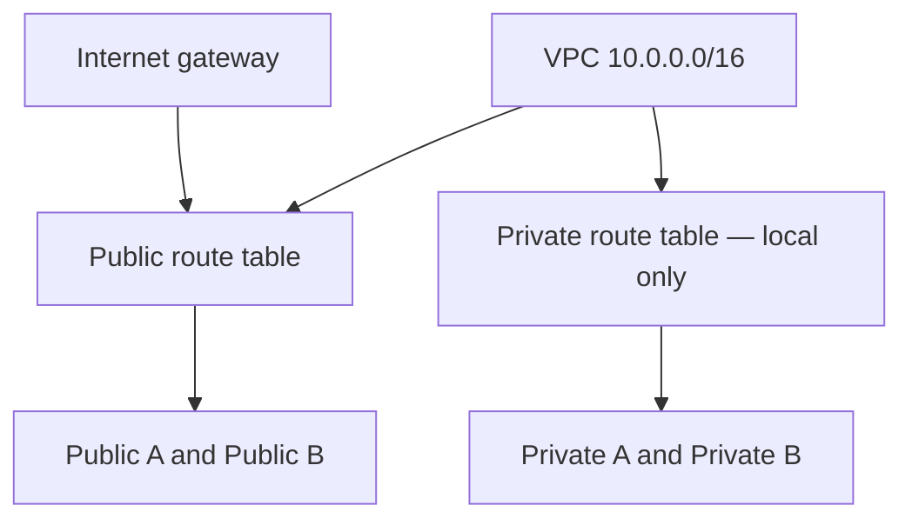

# Lab 07 — Multi-AZ VPC Security Architecture

## Overview

This project implements a custom IPv4 VPC across two Availability Zones with separate public and private routing, explicit public-IP behavior, tier-referenced security groups, and custom network ACLs. The design demonstrates layered controls for a conceptual web, application, and database stack without deploying compute resources.

## Architecture

| Item | Configuration |
| --- | --- |
| Region | US East (N. Virginia), `us-east-1` |
| VPC | `DevGarza-VPC-Lab`, `10.0.0.0/16` |
| Availability Zones | `us-east-1a`, `us-east-1b` |
| Internet gateway | `DevGarza-IGW-lab` |
| Public routing | Local route plus `0.0.0.0/0` to the internet gateway |
| Private routing | Local VPC route only |
| NAT gateway | Not deployed |
| IPv6 | Not configured |

### Subnet plan

| Subnet | Availability Zone | IPv4 CIDR | Route class | Auto-assign public IPv4 |
| --- | --- | --- | --- | --- |
| `DevGarza-Public-A` | `us-east-1a` | `10.0.0.0/24` | Public | Enabled |
| `DevGarza-Private-A` | `us-east-1a` | `10.0.1.0/24` | Private | Disabled |
| `DevGarza-Public-B` | `us-east-1b` | `10.0.2.0/24` | Public | Enabled |
| `DevGarza-Private-B` | `us-east-1b` | `10.0.3.0/24` | Private | Disabled |

Each `/24` provides 256 IPv4 addresses, with 251 available for use after the five addresses AWS reserves in every subnet.

## Security-group design

Security groups were referenced by group identity between tiers, avoiding broad CIDR access for application and database flows.

| Security group | Direction | Protocol / port | Source or destination | Purpose |
| --- | --- | --- | --- | --- |
| `DevGarza-Web-SG` | Inbound | TCP 443 | `0.0.0.0/0` | Customer HTTPS traffic |
| `DevGarza-Web-SG` | Inbound | TCP 22 | `10.0.0.128/28` | Administrator SSH |
| `DevGarza-Web-SG` | Outbound | TCP 8080 | `DevGarza-App-SG` | Web-to-application traffic |
| `DevGarza-App-SG` | Inbound | TCP 8080 | `DevGarza-Web-SG` | Application traffic from the web tier |
| `DevGarza-App-SG` | Inbound | TCP 22 | `10.0.0.128/28` | Administrator SSH |
| `DevGarza-App-SG` | Outbound | TCP 3306 | `DevGarza-DB-SG` | Application-to-database traffic |
| `DevGarza-DB-SG` | Inbound | TCP 3306 | `DevGarza-App-SG` | MySQL traffic from the application tier |
| `DevGarza-DB-SG` | Inbound | TCP 22 | `10.0.0.128/28` | Administrator SSH |
| `DevGarza-DB-SG` | Outbound | None | — | No new outbound connections permitted |

TCP 8080 and MySQL 3306 were documented lab assumptions for the conceptual application and database tiers. No web, application, or database instances were deployed.

## Network ACL design

The custom network ACLs were configured as stateless filters, so return-path ports were allowed explicitly. Lower rule numbers take precedence.

### Public-subnet ACL

| Rule | Direction | Protocol / port | CIDR | Action |
| ---: | --- | --- | --- | --- |
| 10–50 | Inbound | TCP 443 | Simulated threat `/32` addresses | Deny |
| 100 | Inbound | TCP 22 | `10.0.0.128/28` | Allow |
| 110 | Inbound | TCP 443 | `0.0.0.0/0` | Allow |
| 120 | Inbound | TCP 1024–65535 | `10.0.1.0/24` | Allow |
| 130 | Inbound | TCP 1024–65535 | `10.0.3.0/24` | Allow |
| 10–50 | Outbound | All traffic | Simulated threat `/32` addresses | Deny |
| 100 | Outbound | TCP 1024–65535 | `0.0.0.0/0` | Allow |
| 110 | Outbound | TCP 8080 | `10.0.1.0/24` | Allow |
| 120 | Outbound | TCP 8080 | `10.0.3.0/24` | Allow |
| `*` | Both | All traffic | `0.0.0.0/0` | Deny |

The simulated deny list contained `192.0.10.52/32`, `192.0.2.10/32`, `198.51.100.10/32`, `203.0.113.10/32`, and `203.0.113.20/32`.

### Private-subnet ACL

| Rule | Direction | Protocol / port | CIDR | Action |
| ---: | --- | --- | --- | --- |
| 100 | Inbound | TCP 22 | `10.0.0.128/28` | Allow |
| 110–120 | Inbound | TCP 8080 | `10.0.0.0/24`, `10.0.2.0/24` | Allow |
| 130–140 | Inbound | TCP 3306 | `10.0.1.0/24`, `10.0.3.0/24` | Allow |
| 150–160 | Inbound | TCP 1024–65535 | `10.0.1.0/24`, `10.0.3.0/24` | Allow |
| 100–110 | Outbound | TCP 1024–65535 | `10.0.0.0/24`, `10.0.2.0/24` | Allow |
| 120–130 | Outbound | TCP 3306 | `10.0.1.0/24`, `10.0.3.0/24` | Allow |
| 140–150 | Outbound | TCP 1024–65535 | `10.0.1.0/24`, `10.0.3.0/24` | Allow |
| `*` | Both | All traffic | `0.0.0.0/0` | Deny |

The public ACL was associated with both public subnets, and the private ACL was associated with both private subnets.

## Validation

| Check | Result |
| --- | --- |
| Availability | Four subnets distributed evenly across two Availability Zones |
| Public route-table associations | Public A and Public B |
| Private route-table associations | Private A and Private B |
| Internet routes | Two public subnets routed to the internet; zero private subnets routed to the internet |
| Public IPv4 behavior | Enabled only on the two public subnets |
| Tier segmentation | Web-to-app and app-to-database rules used security-group references |
| ACL associations | Public and private ACLs attached to the intended subnet pairs |

Because no workloads were launched, validation covered AWS configuration and association state rather than end-to-end packet testing.

## Cost and cleanup controls

No EC2 instances, NAT gateways, load balancers, Elastic IP addresses, or allocated public IPv4 addresses were created. An Application Load Balancer remained a design-only component because the lab had no targets and did not require live traffic testing.

After verification, the custom VPC was deleted with its 11 dependent resources. Final checks showed only the account's default VPC, default subnets, default route table, default network ACL, default security group, and default internet gateway resources.

## Key takeaways

- A subnet is public because of its routing and workload addressing, not its name.
- Security groups are stateful and work well for tier-to-tier identity references.
- Network ACLs are stateless, evaluate rules by number, and require explicit return-path allowances.
- Configuration validation and packet-flow validation are different evidence levels and should be reported separately.
- Cost-aware lab design includes both avoiding unnecessary managed resources and proving cleanup afterward.

[Back to project index](../../README.md)
